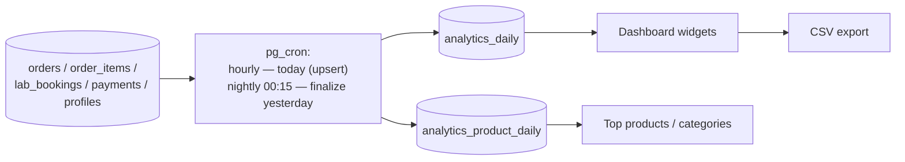

# Analytics & Reporting Blueprint

Dashboard and reports for `/admin` and `/admin/reports`. Core decision from the architecture review (W9): **the dashboard never scans OLTP tables** — all widgets read pre-computed rollups (`0019_analytics.sql`), so reporting load can never degrade checkout.

---

## 1. Rollup pipeline



```
analytics_daily          day (PK), orders_count, orders_value_paisa, paid_value_paisa,
                         refunds_paisa, aov_paisa, bookings_count, bookings_value_paisa,
                         new_customers, cancelled_orders, cod_share_pct
analytics_product_daily  day, variant_id, category_id (denorm), units, revenue_paisa
```

- All dates bucketed in **Asia/Karachi** (business timezone from settings) — never UTC-day, which shifts evening sales to the wrong day.
- Rollups are **recomputed, not incremented** (idempotent upsert per day) — a re-run after a bug fix heals history. Late mutations (refund landing days later) are healed by a nightly 7-day re-roll window.
- Month/year views aggregate daily rows at query time (365 rows — trivial).

## 2. Metric definitions (single source of truth, stated once)

| Metric | Definition |
|---|---|
| Revenue | Order value of orders **not cancelled**, net of refunds; COD counts on **delivery**, gateway on **payment**. Displayed as "Recognized revenue"; "Booked value" (placed orders) shown separately — mixing the two is the classic COD-market reporting error |
| Orders | Placed count (incl. later-cancelled, shown with cancellation rate) |
| Lab bookings | Placed count + value; completion rate (report_ready / placed) |
| AOV | Recognized revenue ÷ delivered orders |
| Top products | Units and revenue per variant, rolled to product |
| Best categories | Product revenue via denormalized `category_id` (primary category snapshot at sale time) |
| Customer growth | New `profiles` per day; repeat-purchase rate (customers with 2+ delivered orders) |

## 3. Dashboard (`/admin`)

- **KPI row**: today + 7d + 30d — recognized revenue, booked value, orders, bookings, new customers; each with delta vs previous period.
- **Charts** (design per `dataviz` conventions/DESIGN-SYSTEM): daily revenue line (30/90d toggle), orders vs bookings stacked bar, COD-vs-paid share, monthly revenue bars (12mo), yearly summary table.
- **Lists**: top 10 products (units/revenue toggle), top categories, low-stock count (links to inventory), pending work (unshipped orders, Rx review queue, today's collections).

`/admin/reports` adds date-range pickers, granularity (day/month/year), and drill-downs: Sales (orders table w/ filters), Products (full ranking), Customers (growth + repeat rate). **Every report exports CSV** (streamed from rollups).

Permission: `reports.view`; revenue widgets additionally `reports.revenue` (support staff see ops widgets only).

## 4. Future business intelligence

- Ledger-first schema means facts are already event-shaped: `orders`, `stock_movements`, `payments`, `coupon_redemptions` export cleanly as fact tables; products/categories/customers as dimensions — a star schema without re-modeling.
- Path: nightly export (Postgres `COPY` → object storage / Fivetran) → warehouse (BigQuery/ClickHouse) → BI tool (Metabase first — it can even sit directly on a read replica as step zero).
- Event analytics (funnels, search-with-no-results, cart abandonment) is future client-side instrumentation (PostHog self-host friendly) — deliberately **not** homegrown; the rollup tables stay commerce-only.
- Reserved additions to `analytics_daily` when needed: sessions, conversion_rate (populated from the event tool, keeping one reporting surface).
