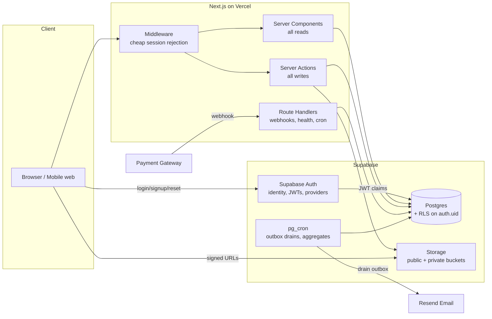
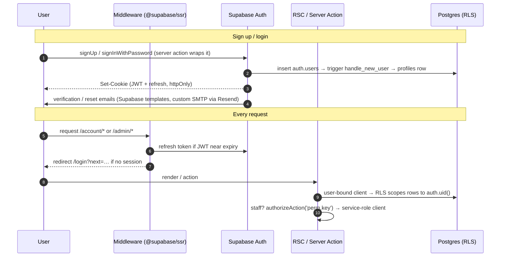
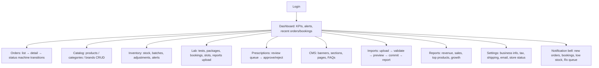
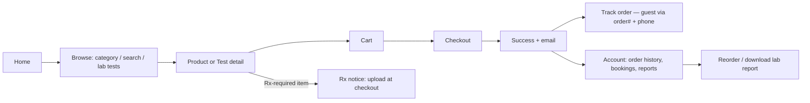
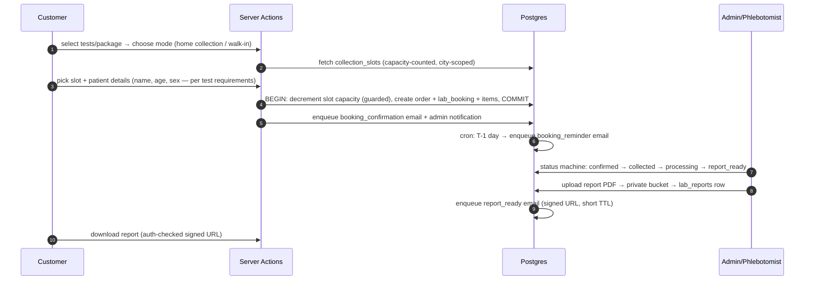
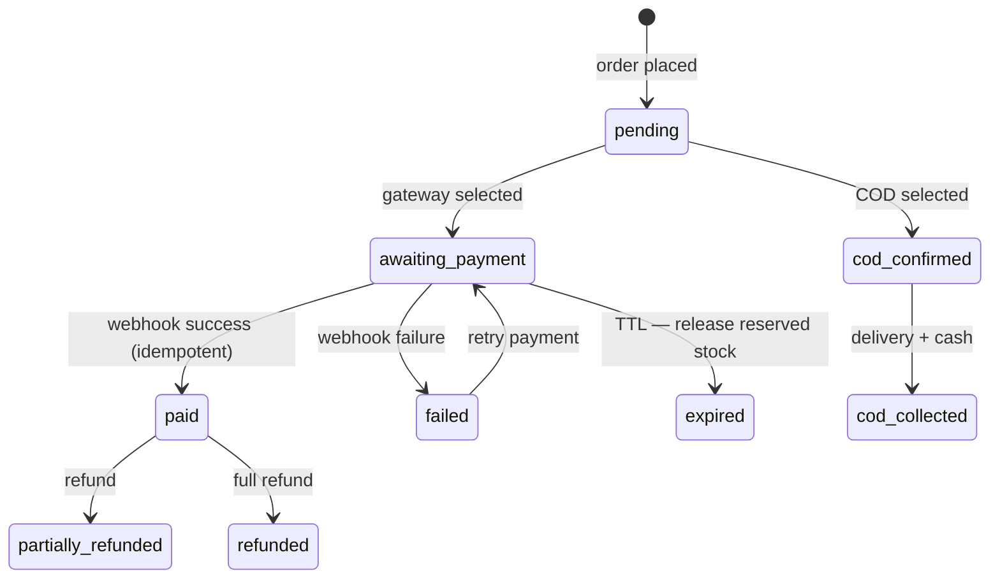

# Sehat Store — Master Blueprint

> Complete pre-code architecture for the Healthcare E-commerce Platform (Pharmacy + Lab Tests + Admin Panel).
> This document is the umbrella; module deep-dives live in sibling docs (see §16 Index).
> Companion docs already in place: `ARCHITECTURE.md` (stack rationale), `DATABASE.md` (schema philosophy), `SECURITY.md`, `DESIGN-SYSTEM.md`, `UI-SPEC.md`.

**Status of this document:** reviewed for weaknesses (§15) and revised. The flows below are the *post-review* versions — each improvement adopted from the review is already folded in.

---

## 1. System Architecture

### 1.1 Stack (confirmed, matching existing codebase)

| Layer | Choice | Notes |
|---|---|---|
| Framework | Next.js 15 (App Router), React 19, TypeScript | RSC for reads, Server Actions for writes |
| Styling | Tailwind + shadcn/ui pattern | See DESIGN-SYSTEM.md |
| Database | Supabase Postgres | 15 migrations; RLS deny-by-default landed in `0014_rls.sql` |
| Auth | **Supabase Auth** (email/password now; OAuth/phone-OTP are config, not code) | ✅ Live since Step 2; interim scrypt/session code fully removed; see §5 |
| Storage | Supabase Storage | Public bucket (product/CMS media), private bucket (prescriptions, lab reports) |
| Email | Resend behind a provider adapter | See `EMAIL.md` |
| Payments | Gateway adapter (COD first; card gateway pluggable) | See §13 |
| Background work | Supabase `pg_cron` + queue tables (outbox pattern) | No separate worker infra in V1 |
| Validation | Zod at every boundary | Client never sends money; server re-prices |
| Hosting | Vercel + Supabase cloud | CDN for static + media |

### 1.2 High-level diagram



### 1.3 Core architectural rules

1. **`app/` routes, `features/` decides.** Route files stay thin; business logic lives in `src/features/<domain>/{actions,queries,schemas,components}`.
2. **Reads = RSC queries, writes = Server Actions.** Route handlers exist only for webhooks, health checks, and cron endpoints.
3. **Postgres is the only source of truth.** The in-memory data layer (`src/lib/data`) is a prototype scaffold and is retired module-by-module as Supabase wiring lands (§15, W1).
4. **Every side effect that must not be lost goes through an outbox table** (emails, notifications, webhook processing) — never fire-and-forget from a serverless function.
5. **Money is `bigint` paisa everywhere.** No floats, ever.
6. **Permissions, not roles, gate every admin action** (`authorizeAction('permission.key')`).
7. **Ledgers over counters**: stock, coupon redemptions, and analytics all derive from append-only movement tables; counters are caches.

---

## 2. Folder Structure

Extends the existing layout; new modules in **bold**.

```
src/
├── app/
│   ├── (marketing)/          # home, about, contact, policies, faqs
│   ├── (shop)/               # pharmacy, products, categories, search,
│   │                         # lab-tests, health-packages, cart, checkout, track-order
│   ├── (auth)/               # login, register, forgot-password, reset-password, verify-email
│   ├── (account)/            # profile, orders, bookings, addresses, prescriptions, notifications
│   ├── admin/                # dashboard + all admin modules (see §3)
│   └── api/
│       ├── health/
│       ├── webhooks/payment/
│       └── cron/             # outbox drain, aggregates, reminders (secured by CRON_SECRET)
├── features/
│   ├── auth/  catalog/  cart/  checkout/  orders/  lab/
│   ├── **cms/**              # sections, banners, offers, pages, faqs
│   ├── **imports/**          # Excel import engine (products + lab tests)
│   ├── **inventory/**        # stock ops, adjustments, alerts
│   ├── **email/**            # template registry, renderers, outbox enqueue
│   ├── **analytics/**        # aggregate queries, dashboard widgets
│   ├── **settings/**         # typed settings registry
│   ├── **notifications/**    # event router, channel adapters
│   └── prescriptions/        # (schema exists; feature module to be built)
├── lib/
│   ├── supabase/             # server client, admin client, typed helpers  ← replaces lib/data
│   ├── security/             # password, session, rate-limit (move to Postgres-backed buckets)
│   ├── email/                # provider adapter (Resend), layout, esc()
│   └── utils/
├── config/                   # site.ts, admin-nav.ts, locations.ts
└── components/               # ui, layout, shared, admin
```

Feature module shape (uniform): `actions/` (writes), `queries/` (reads), `schemas/` (zod), `components/`.

---

## 3. Route Structure

Full page-level sitemap with navigation notes: **`SITEMAP.md`**. Summary:

| Group | Routes |
|---|---|
| Public | `/`, `/pharmacy`, `/products/[slug]`, `/categories/[slug]`, `/search`, `/lab-tests`, `/lab-tests/[slug]`, `/health-packages`, `/health-packages/[slug]`, `/about`, `/contact`, `/faqs`, `/policies/{privacy,terms,shipping,returns}`, `/track-order` |
| Auth | `/login`, `/register`, `/forgot-password`, `/reset-password`, `/verify-email` |
| Customer | `/account`, `/account/orders[/#]`, `/account/bookings[/#]`, `/account/addresses`, `/account/prescriptions`, `/account/notifications`, `/account/settings` |
| Checkout | `/cart`, `/checkout`, `/checkout/success/[orderNumber]` |
| Admin | `/admin` + modules: products, categories, brands, inventory, orders, customers, lab-tests, lab-bookings, prescriptions, coupons, shipping, cms, imports, reports, notifications, settings, forbidden |
| API | `/api/health`, `/api/webhooks/payment`, `/api/cron/{outbox,aggregates,reminders}` |
| Errors | `not-found.tsx`, `error.tsx`, `/admin/forbidden`, maintenance interstitial |

---

## 4. Database Modules

40+ tables across 12 existing migrations plus 7 planned. Money = paisa `bigint`; snapshots on order lines; ledgers everywhere.

| Module | Migration | Tables |
|---|---|---|
| Foundation | 0001 | enums, triggers |
| Identity & RBAC | 0002 | profiles, addresses, roles, permissions, role_permissions, user_roles, audit_log |
| Pharmacies | 0003 | pharmacies, pharmacists |
| Catalog | 0004 | brands, categories, products, product_categories, product_variants, product_images |
| Inventory | 0005 | inventory_batches, stock_movements |
| Diagnostics | 0006 | labs, lab_tests, lab_test_pricing, health_packages, health_package_tests |
| Prescriptions | 0007 | prescriptions, prescription_reviews |
| Coupons | 0008 | coupons, coupon_scopes, coupon_redemptions |
| Commerce | 0009 | carts, cart_items, orders, order_items, order_item_batches, order_status_history |
| Lab bookings | 0010 | collection_slots, lab_bookings, lab_booking_items, lab_reports |
| Shipping | 0011 | shipping_zones, shipping_zone_areas, shipping_methods, shipping_rates, shipments, shipment_items |
| Payments | 0012 | payments, refunds, cod_collections |
| **Rate limits** | 0013 ✅ | rate_limits (Postgres-backed, serverless-safe — W2; sessions belong to Supabase Auth) |
| **RLS** | 0014 ✅ | deny-by-default baseline + `auth.uid()` policies: public catalog, own-data customer access, service-role-only financial writes (W3) |
| **Storage** | 0015 ✅ | buckets: media (public), prescriptions/lab-reports/imports (private) + owner-folder policies on `auth.uid()` |
| **Email outbox** | 0016 ✅ | email_outbox (queue+log in one, W5) + `claim_email_outbox()` (SKIP LOCKED, backoff-as-visibility-timeout) |
| **Commerce core** | 0017 ✅ | `place_order()` (atomic checkout: items, FEFO stock, slot claim, coupon ledger, payment, history, outbox), `reserve_stock()`, `release_order_stock()` (idempotent, W4); `orders.idempotency_key` |
| **Admin ops** | 0018 ✅ | `release_slot()` (guarded capacity release on cancellation) |
| **Settings** | 0019 ✅ | settings, settings_history (typed registry; business info + store status live) |
| **CMS (lean V1)** | 0020 ✅ | cms_pages, cms_page_versions (policy pages, plain-text, versioned saves). Full CMS (banners, sections, media, email templates) still planned |
| **Notifications** | 0021 (planned) | notifications, notification_preferences, webhook_events |
| **Imports** | 0022 (planned) | imports, import_rows |
| **Analytics** | 0023 (planned) | analytics_daily, analytics_product_daily, stock_alerts |

Deep-dives: `DATABASE.md` (philosophy), plus per-module docs (§16).

---

## 5. Authentication Flow

**Supabase Auth is the identity provider** for customers *and* staff. It owns credentials, password hashing, email verification, reset flows, token refresh, MFA, and future providers (Google OAuth, phone OTP are dashboard config + one UI button — no schema change). The app owns **authorization**: `profiles` (1:1 with `auth.users`, auto-created by the `handle_new_user` trigger), RBAC (`user_roles` → `has_permission()`), and RLS keyed on `auth.uid()`. Guest checkout stays first-class (COD market).

Session transport is `@supabase/ssr`: httpOnly cookies carrying the JWT + refresh token; middleware refreshes expiring tokens. Two DB client shapes (`src/lib/supabase/server.ts`):

| Client | Credentials | RLS | Used for |
|---|---|---|---|
| User-bound | anon key + user JWT | **enforced** | account pages, own-data reads/writes — the DB itself guarantees row ownership |
| Service-role | service key (server-only) | bypassed | admin/staff ops (guarded by `authorizeAction`), guest checkout, webhooks, cron |



- **Register**: `signUp` → confirmation email → `/auth/callback` completes verification. Unverified users can browse and place COD orders (guest parity) but not access account history.
- **Forgot/reset**: `resetPasswordForEmail` → recovery link → `/reset-password` updates via Supabase; refresh-token revocation logs out other devices.
- **Staff**: same login; "is staff" = holds any `user_roles` row. Admin routes keep the triple guard: middleware (session presence) → admin layout (`requireUser` + staff check) → per-action `authorizeAction(permission)`.
- **Auth emails** (verify, reset) are sent by Supabase Auth through custom SMTP — the outbox (§10) handles all *commerce* email; auth email deliberately stays with the identity provider.
- **Provider extensibility**: adapters are Supabase Auth's job — enabling Google/phone-OTP touches dashboard config and a login-page button only. `profiles`/RBAC/RLS are provider-agnostic by construction.

---

## 6. Admin Flow

Three-layer guard: middleware (cookie presence) → admin layout `requireUser()` + staff check → per-action `authorizeAction(permission)`.



Roles seeded: `admin`, `manager`, `pharmacist`, `support` — mapped to granular permissions (`orders.update_status`, `cms.publish`, `inventory.adjust`, `prescriptions.review`, `settings.write`, `imports.run`, …). Every admin mutation writes `audit_log` (actor, action, entity, before/after diff).

---

## 7. Customer Flow



Guest-first: browsing, cart, checkout, tracking all work without an account. Account adds: history, saved addresses, prescription wallet, lab report downloads, notification preferences. Cart is client-context backed by a `carts` row when logged in; **guest cart merges into account cart on login** (union, keep max qty).

---

## 8. Checkout Flow

The critical path. Server re-prices everything; stock is reserved atomically; Rx items gate fulfilment, not ordering.

```mermaid
sequenceDiagram
    autonumber
    participant C as Customer
    participant SA as place-order (Server Action)
    participant DB as Postgres
    participant OB as Outbox/Cron

    C->>SA: submit checkout (items, address, method, coupon, Rx files?)
    SA->>SA: zod validate + rate limit
    SA->>DB: BEGIN
    SA->>DB: re-price items from catalog (never trust client)
    SA->>DB: validate coupon (scopes, window, redemption ledger)
    SA->>DB: compute shipping (zone match by city → rate)
    SA->>DB: reserve_stock() — FEFO batch pick,<br/>SELECT … FOR UPDATE, fail if short
    SA->>DB: insert order + items + item_batches (price snapshots)<br/>+ status_history(placed) + payment(pending)
    SA->>DB: enqueue email_outbox(order_confirmation)<br/>+ notifications(admin: new_order)
    SA->>DB: COMMIT  (all-or-nothing)
    SA-->>C: redirect /checkout/success/[orderNumber]
    OB->>OB: drain outbox → send emails, deliver notifications
    Note over SA,DB: COD → order confirmed immediately.<br/>Gateway → order 'awaiting_payment', stock held with TTL;<br/>webhook confirms or TTL releases (§13).
```

Failure behavior: any step fails → transaction rolls back → customer sees actionable error (e.g., "Only 2 left of X") → cart intact. Stock shortfall triggers a cart-line correction, not a silent removal.

---

## 9. Lab Booking Flow

Lab bookings ride the same `orders` financial umbrella (disjoint subtype → `lab_bookings`).



Slot capacity uses the same guarded-decrement pattern as stock (no overbooking). Reschedule = release old slot + claim new, one transaction. Cancellation before collection → slot released, refund per policy.

---

## 10. Email Flow

Full design: **`EMAIL.md`**. Principles:

- **Outbox pattern**: business transaction inserts `email_outbox` row *inside the same DB transaction*. A cron drain (`/api/cron/outbox`, every minute) renders + sends via the Resend adapter with retry/backoff. An order can never exist without its confirmation email being durably queued.
- **Template registry** (`email_templates`): admin-editable subject + MJML-ish body with typed variables; versioned; falls back to code-shipped defaults.
- All 10 transactional emails (order confirmation → delivered, booking confirmation/reminder, password reset, welcome, admin alerts) share one layout with `esc()` on every variable.
- `email_log` records every send (status, provider id); `email_suppressions` respects bounces.

## 11. Shipping Flow

- Admin defines `shipping_zones` → member cities (`shipping_zone_areas`) → `shipping_methods` (standard/express) → `shipping_rates` (flat, free-above-threshold, weight-based ready).
- Checkout resolves rate by customer city; unmatched city = not serviceable (say so *before* payment).
- Fulfilment: order `processing` → create `shipment` (courier, tracking#, items) → `shipped` (email w/ tracking) → `delivered` (email; COD: record `cod_collections`).
- Partial shipments supported by `shipment_items`. Courier API integration is a future adapter — V1 is manual tracking-number entry.

## 12. Payment Flow



- **Gateway adapter interface** (`createPaymentIntent`, `verifyWebhook`, `refund`) — COD is simply an adapter that auto-confirms. Card gateway (e.g., Safepay/Stripe) plugs in without touching checkout.
- **Webhook hardening**: signature verification → insert into `webhook_events` with a unique provider event id (**idempotency** — duplicates no-op) → process in transaction → mark processed. Ledger: every attempt is a `payments` row; refunds reference payments; DB CHECKs keep totals balanced.

## 13. Module Summaries

Each has a dedicated blueprint doc (§16): CMS, Product Import, Lab Test Import, Inventory, Email, Analytics, Settings, Notifications.

## 14. Future Scalability

| Horizon | Change | Prepared by |
|---|---|---|
| Near | Enable card gateway | Payment adapter (§12) |
| Near | Multi-warehouse | Stock already scoped `(pharmacy_id, variant, batch)` — pharmacies *are* locations |
| Near | SMS/WhatsApp | Notification channel adapter (`NOTIFICATIONS.md`) |
| Mid | Courier API integration | Shipping adapter; shipments table already models it |
| Mid | Urdu/RTL i18n | Design system tokens; route-level locale segment `/(ur)` reserved |
| Mid | Read replicas + PgBouncer | All reads already flow through `queries/` — single switch point |
| Mid | Redis (sessions, rate limits, hot cache) | Interfaces already isolate the backing store |
| Far | Native apps | Server Actions get sibling REST/tRPC layer over the same `features/` logic |
| Far | BI warehouse | `analytics_daily` + ledgers export cleanly to a star schema (`ANALYTICS.md`) |
| Far | Service extraction | Feature-module seams (imports, notifications, analytics) are the natural cut lines |

## 15. Architecture Review — Weaknesses Found & Improvements Adopted

The pre-review draft was audited; every weakness below is **already corrected in the flows above**.

| # | Weakness found | Improvement adopted |
|---|---|---|
| W1 | **Docs/reality gap**: 12 migrations exist but runtime uses in-memory stores; no Supabase client installed. Silent divergence risk. | In progress via the `lib/data/source.ts` seam. ✅ Wired (Step 4): pharmacy catalog reads, cart snapshot, checkout writes, tracking, slot availability — DB-backed when configured, scaffold otherwise. Remaining: lab content pages, admin console (Step 5+); scaffold deletes when the last module flips. `npm run check` stays the regression gate. |
| W2 | **In-memory sessions & rate limits break on serverless** — instances share nothing; users randomly logged out, limits ineffective. | ✅ Sessions: delegated to Supabase Auth (JWT + refresh cookies via `@supabase/ssr`) — no session store to scale at all. Rate limits: Postgres table (`0013`), Redis later if hot. |
| W3 | **No RLS despite health data** — one leaked anon key or query bug exposes prescriptions/reports. | ✅ Done (Step 1, revised for Supabase Auth): `0014_rls.sql` — deny-by-default baseline, then `auth.uid()` policies (own-data reads, no client writes on financial tables); `0015_storage.sql` — private buckets with owner-folder policies. Behavior-verified by `npm run check:migrations`. |
| W4 | **Stock race conditions**: concurrent checkouts could oversell; cancellations could double-restore. | `reserve_stock()` with `SELECT … FOR UPDATE` + ledger-derived quantities; restore is a compensating ledger entry keyed to order id (idempotent). Same pattern reused for lab slot capacity and coupon redemptions. |
| W5 | **Fire-and-forget email** — a crash after COMMIT loses the confirmation email forever. | Outbox pattern (§10): email enqueue is part of the order transaction; cron drains with retries. |
| W6 | **Webhook replay/duplication** unhandled → double-paid orders. | `webhook_events` unique on provider event id; processing is transactional and idempotent (§12). |
| W7 | **Gateway payments could hold stock forever** if customer abandons the payment page. | `awaiting_payment` TTL (30 min) → cron releases reservation and expires order (§12 state machine). |
| W8 | **Excel imports vs serverless timeouts** — a 5,000-row file blows the function limit. | Two-phase import: upload → staged rows in `import_rows` → chunked validation/commit via cron-resumable batches (`IMPORT-PRODUCTS.md`). |
| W9 | **Analytics on OLTP** — dashboard aggregates scanning `orders` degrade checkout under load. | Nightly (plus hourly-today) rollups into `analytics_daily` tables; dashboard reads rollups only (`ANALYTICS.md`). |
| W10 | **No customer accounts built** (login was admin-only) → password reset, history, report downloads impossible. | ✅ Done (Step 2): register/login/verify/reset/callback pages live on Supabase Auth; `/account` landing built; staff login separated at `/admin/login` with a discard-non-staff-session gate; guest checkout untouched. History/addresses/reports pages arrive with their modules (Steps 3+). |
| W11 | **Guest order tracking could leak PII** if order number alone suffices (enumerable). | Track-order requires order# **+** phone last-4 match; responses omit full address; rate-limited. |
| W12 | **CMS/media without versioning** — a bad publish breaks the homepage with no undo. | CMS uses draft→publish with version history and one-click rollback; `revalidateTag` scoped per section (`CMS.md`). |
| W13 | **No maintenance switch** — store can't be safely paused (e.g., during migration cutover). | ✅ Partially done (Step 6): `store.status` setting pauses pharmacy orders and/or lab bookings independently, enforced in the checkout action (browsing stays live). Full-site maintenance interstitial remains future. |
| W14 | **Rx compliance gap**: Rx-required items could ship unreviewed. | ✅ Done (Step 7): Rx orders start life `awaiting_rx`; checkout uploads the prescription (guests included, private bucket); the `/admin/prescriptions` queue gates approval on a pharmacists **licence record** (not just the role); approval confirms the order only when every Rx line is approved; rejection emails the customer the reason via the outbox. Smoke-verified end-to-end. |

## 16. Blueprint Index

| Doc | Covers |
|---|---|
| `BLUEPRINT.md` | this document — architecture + all flows |
| `SITEMAP.md` | every page, navigation map, UX improvements |
| `CMS.md` | admin-editable content: banners, sections, pages, policies, FAQs |
| `IMPORT-PRODUCTS.md` | Excel product import engine |
| `IMPORT-LAB-TESTS.md` | Excel lab-test import engine |
| `INVENTORY.md` | stock ledger, alerts, adjustments, warehouse readiness |
| `EMAIL.md` | template registry, outbox, all transactional emails |
| `ANALYTICS.md` | dashboard metrics, rollups, BI path |
| `SETTINGS.md` | typed settings registry, store status, business hours |
| `NOTIFICATIONS.md` | event routing, in-app/email channels, SMS/WhatsApp future |
