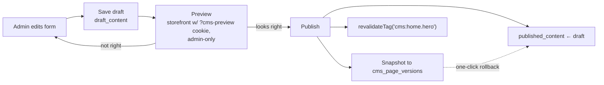

# CMS Blueprint — Admin-Editable Content

Goal: the admin manages every piece of storefront content **without touching code**. No external headless CMS — a focused, typed CMS inside the admin panel, backed by Postgres (`0015_cms.sql`) and Supabase Storage.

Guiding decision: **typed sections, not a free-form page builder.** Every editable area is a known component with a Zod-validated content shape. Admins fill forms; the storefront renders known components. This keeps design-system integrity (see `DESIGN-SYSTEM.md`) and makes content safe to validate, version, and roll back.

---

## 1. What the admin can manage

| Content | Model | Editing UI |
|---|---|---|
| Homepage banners | `cms_banners` collection | List with drag-order, schedule windows |
| Offers | `cms_offers` collection (linked to coupons optionally) | Card editor + landing-section placement |
| Hero section | `cms_sections` key `home.hero` | Form: heading, subheading, search placeholder, CTA, background image |
| Homepage categories | `cms_sections` key `home.categories` | Picker: choose + order categories, override tile image |
| Featured products | `cms_sections` key `home.featured` | Product picker (search by SKU/name), manual order, optional "auto: bestsellers" mode |
| Health packages strip | `cms_sections` key `home.packages` | Package picker + order |
| Footer | `cms_sections` key `global.footer` | Link groups (label + URL), column order |
| Contact details | Reads from **Settings** (single source; CMS shows a link, doesn't duplicate) | `/admin/settings` |
| FAQs | `cms_faqs` collection | Grouped by topic, drag-order, publish toggle |
| About Us | `cms_pages` slug `about` | Rich text (constrained) + image blocks |
| Privacy / Terms / Shipping / Return policies | `cms_pages` slugs `privacy`, `terms`, `shipping`, `returns` | Rich text, "last updated" auto-stamped |

## 2. Data model (`0015_cms.sql`)

```
cms_sections        key (unique, e.g. 'home.hero'), draft_content jsonb,
                    published_content jsonb, published_at, updated_by
cms_banners         id, title, image_asset_id, mobile_image_asset_id, link_url,
                    alt_text, sort_order, starts_at, ends_at, is_active
cms_offers          id, title, description, image_asset_id, link_url, coupon_id?,
                    starts_at, ends_at, sort_order, is_active
cms_pages           id, slug (unique), title, draft_body jsonb (rich-text AST),
                    published_body jsonb, seo_title, seo_description,
                    published_at, updated_by
cms_page_versions   id, page_or_section_ref, content jsonb, created_by, created_at
cms_faqs            id, topic, question, answer (rich text), sort_order, is_published
media_assets        id, bucket, path, alt_text, width, height, bytes, mime,
                    uploaded_by, created_at
```

Content shapes are **Zod schemas in code** (`features/cms/schemas/`), one per section key — the DB stores jsonb, the app guarantees shape. Unknown/invalid published content fails safe to the code-shipped default for that section.

## 3. Draft → Publish workflow



- Every save writes `draft_content` only; storefront reads `published_content`.
- **Preview**: admin gets a signed preview cookie; storefront components read draft when present. No separate preview deployment.
- **Publish** requires `cms.publish` permission (edit and publish can be different roles); snapshots the previous version; rollback = publish an old version.
- **Cache**: storefront reads are cached with per-key tags (`cms:home.hero`, `cms:page:about`); publish revalidates only its own tag — a banner change never busts the product cache.
- Banners/offers additionally honor `starts_at`/`ends_at` scheduling at render time — content can be staged before a sale.

## 4. Media library

- `/admin/cms/media`: upload (client → signed upload URL → Supabase Storage public bucket), browse grid, search by filename/alt.
- Enforced on upload: mime allowlist (jpeg/png/webp/svg-sanitized), max 2 MB, required alt text; width/height captured for CLS-free rendering.
- Assets are referenced by id (never raw URLs) so files can be re-pathed/CDN-fronted later. Delete is blocked while referenced (reference count query).

## 5. Admin UI (`/admin/cms`)

Hub page with cards per area (Banners, Home Sections, Offers, Pages, FAQs, Media), each showing publish status + last edited. Section editors are plain forms generated per schema: text inputs, image pickers (opens media library), link fields (internal-route picker or external URL), drag-to-reorder lists, schedule pickers. Rich text (pages, FAQ answers) uses a constrained editor — headings, bold/italic, lists, links, images from the library only; stored as JSON AST (never raw HTML) and rendered through the design system → XSS-safe by construction.

## 6. Permissions & audit

`cms.edit` (save drafts), `cms.publish`, `cms.media` (upload/delete). All publishes land in `audit_log` with the version snapshot id — full who/what/when history.

## 7. Failure & review notes

- **Fail-safe rendering**: any section that fails schema-parse renders its default, never a broken homepage (blueprint review W12).
- Policies pages show auto "Last updated" — a legal requirement kept honest by publish timestamps.
- Contact details deliberately live in Settings only — one source of truth; CMS footer references them by token (`{{business.phone}}`) resolved at render.
- Future: locale column on sections/pages reserves the path to Urdu content without a schema break.
