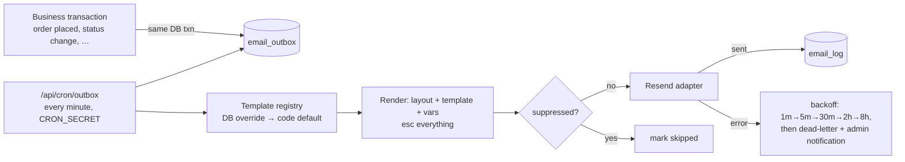

# Email System Blueprint

All transactional email for the platform. Extends the existing `src/lib/email/` scaffold (Resend adapter, layout with `esc()`, order-confirmation template). Two non-negotiables from the architecture review: the **outbox pattern** (W5 — no email is ever lost to a crash) and **escaping every variable** (existing `esc()` discipline).

---

## 1. Architecture



- **Enqueue is transactional**: the row that says "send order confirmation" commits atomically with the order itself.
- **Drain is idempotent**: a claimed-but-crashed row is re-claimed after a visibility timeout; Resend idempotency keys (`outbox:{id}:{attempt}`) prevent double-sends.
- **Provider adapter** (`lib/email/provider.ts`): `send({to, subject, html, idempotencyKey})` — Resend today, swappable (SES) without touching templates.

## 2. Data model

**Implemented (Step 3, `0016_email_outbox.sql`)** — deliberately leaner than
the original sketch:

```
email_outbox   id, template_key, recipient, payload jsonb (full render input,
               snapshotted at enqueue), dedupe_key unique?, status
               (pending|sent|dead), attempts, next_attempt_at, last_error,
               provider_message_id, sent_at, created_at
claim_email_outbox(limit)  -- FOR UPDATE SKIP LOCKED batch claim; pushing
               next_attempt_at forward doubles as visibility timeout AND
               retry backoff (1m, 4m, 16m, ~1h, ~4h; dead after 6)
```

One table is queue and log: terminal rows keep `provider_message_id`/`sent_at`.
`place_order()` (0017) enqueues the confirmation inside the checkout
transaction; `/api/cron/outbox` (guarded by `CRON_SECRET`, scheduled by
`vercel.json`) drains via `src/lib/email/outbox.ts`, rendering from the code
registry in `src/lib/email/`.

**Still planned** (arrives with the CMS/admin phase):

```
email_templates    admin-editable subject/body overrides per key
email_suppressions email, reason (bounce|complaint|manual), created_at
```

## 3. Template registry

Every email = a **code-shipped default** (typed render function + Zod schema for its variables) plus an optional **DB override** (`email_templates`) editable at `/admin/settings` → Email → Templates. Admin edits subject/body with `{{variable}}` placeholders; save validates that only declared variables are used and renders a preview with sample data. "Reset to default" clears the override. All templates share one layout: logo (from settings), brand colors, footer with business address/contact/social (from settings), inline CSS, mobile-first, plain-text alternative generated automatically.

## 4. The emails

| Key | Trigger | To | Key variables |
|---|---|---|---|
| `welcome` | Registration | Customer | name, verify link |
| `password_reset` | Forgot password | Customer | reset link (30-min TTL note) |
| `order_confirmation` | Order placed (COD) / paid (gateway) | Customer | order#, items table, totals, address, payment method, track link |
| `payment_confirmation` | Gateway webhook success | Customer | order#, amount, method, receipt |
| `order_processing` | Status → processing | Customer | order#, ETA |
| `order_shipped` | Shipment created | Customer | order#, courier, tracking#, track link |
| `order_delivered` | Status → delivered | Customer | order#, return-policy window, review nudge |
| `order_cancelled` | Cancellation | Customer | order#, reason, refund info |
| `booking_confirmation` | Lab booking placed | Customer | booking#, tests, slot, mode, address, **preparation instructions** |
| `booking_reminder` | Cron, T-1 day before slot | Customer | slot time, preparation instructions repeated, reschedule link |
| `report_ready` | Report uploaded | Customer | booking#, signed download link (short TTL) + account link |
| `admin_new_order` | Order placed | Admin list | order#, value, COD flag, Rx flag |
| `admin_new_booking` | Booking placed | Admin list | booking#, slot, home-collection flag |
| `admin_low_stock_digest` | Daily 8am cron | Admin list | grouped open alerts |
| `admin_import_complete` | Import finishes | Initiator | counts + report link |
| `admin_dead_letter` | Outbox dead-letter | Admin list | failed template + error |

Admin recipient list and per-type toggles come from Settings → Email (`SETTINGS.md`); admin emails also respect per-user notification preferences (`NOTIFICATIONS.md`).

## 5. Operational rules

- `dedupe_key` (e.g. `order_shipped:{order_id}`) makes status-flapping safe — same email never queues twice.
- `booking_reminder` cron checks the booking is still active before enqueueing (no reminders for cancelled bookings).
- Suppression list consulted at drain time; Resend bounce/complaint webhooks feed it.
- **No marketing email in this system.** Transactional only — promotional campaigns are future scope with separate consent tracking; mixing them risks deliverability of order emails.
- Health-data caution: emails never embed report results or test outcomes — only links behind authentication/signed URLs.
- `email_log` visible per-customer (`/admin/customers/[id]`) and per-order for support debugging ("did the confirmation send?").
