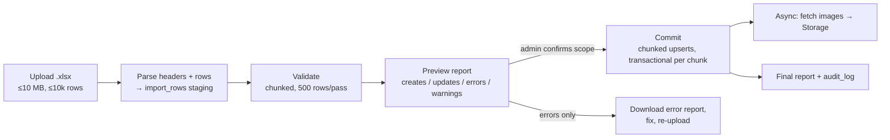

# Product Import Blueprint — Excel Bulk Import

Admin uploads an Excel file; the system imports products, prices, sale prices, categories, brands, stock, SKUs, and images — with validation, duplicate handling, a preview step, and downloadable reports. Designed for serverless constraints (blueprint review W8): **no single request ever processes the whole file.**

---

## 1. Excel template

Downloadable from `/admin/imports/new` (`sehat-products-template.xlsx`), one row per variant:

| Column | Required | Rules |
|---|---|---|
| `sku` | ✅ | Unique key for upsert; trimmed, uppercased |
| `product_name` | ✅ | ≤200 chars |
| `variant_name` | — | e.g. "500mg / 10 tabs"; defaults to "Default" |
| `brand` | ✅ | Matched case-insensitively; **auto-created if new** (flagged in report) |
| `categories` | ✅ | Pipe-separated paths: `Medicines>Pain Relief\|Vitamins`; auto-created with warning |
| `price` | ✅ | PKR decimal → stored as paisa bigint; > 0 |
| `sale_price` | — | Must be < price; empty = no sale |
| `stock` | — | Integer ≥ 0; creates an inventory adjustment (see §5) |
| `rx_required` | — | `yes/no`, default no |
| `description` | — | Plain text |
| `image_urls` | — | Pipe-separated https URLs; fetched async into Storage |
| `is_active` | — | `yes/no`, default yes |

Multiple rows sharing `product_name`+`brand` become one product with multiple variants.

## 2. Pipeline



**Stage 1 — Upload & parse.** File → Storage (`imports/` private bucket) → `imports` row (`status: parsing`). Headers matched case/space-insensitively; unknown columns warned and ignored; missing required columns fail fast with a clear message. Rows land in `import_rows` (raw jsonb per row).

**Stage 2 — Validate** (chunked, resumable via cron if the request budget runs out). Per row: schema checks (types, ranges, sale < price), then resolution against the catalog:

- `sku` exists → row is an **update**; diff computed (only changed fields listed)
- `sku` new → **create**
- Duplicate `sku` *within the file* → later rows errored ("duplicate of row 12")
- Same name+brand as an existing product under a different SKU → **warning** (possible duplicate product), import proceeds — admin judgment call, surfaced loudly

**Stage 3 — Preview.** `/admin/imports/[id]` shows: summary counts (creates / updates / unchanged / errors / warnings), filterable row table with per-row messages, and the update diffs. Admin chooses commit scope: *all valid rows* or *creates only* / *updates only*. Nothing has touched the catalog yet.

**Stage 4 — Commit.** Chunks of 200 rows, each chunk one transaction: upsert brand → categories → product → variant (by SKU) → images queued → stock adjustment if `stock` present. A failing row fails alone (row marked `failed`, chunk continues); progress bar streams from `import_rows` status counts. Interrupted commits resume — every row carries its own state.

**Stage 5 — Images (async).** Cron worker fetches each URL (5 s timeout, mime + 2 MB checks) into Storage and links `product_images`. Failures land in the report as warnings — an image failure never blocks a product.

## 3. Data model (`0018_imports.sql`)

```
imports      id, type ('products'|'lab_tests'), file_path, original_filename,
             status (uploaded→parsing→validating→ready→committing→completed→failed),
             mode ('upsert'|'create_only'|'update_only'), totals jsonb
             (rows, creates, updates, errors, warnings), created_by, timestamps
import_rows  id, import_id, row_number, raw jsonb, parsed jsonb,
             action ('create'|'update'|'skip'|'error'), diff jsonb,
             messages jsonb [{level, field, message}],
             status ('pending'|'valid'|'invalid'|'committed'|'failed')
```

## 4. Reports

- **Preview report** (pre-commit) and **final report** (post-commit) share one UI.
- **Downloadable Excel error report**: original columns + `_status` + `_messages` — fix in place, re-upload the same file. Re-uploading is safe: upsert-by-SKU makes imports **idempotent**.
- Import history at `/admin/imports`: who, when, file, counts; every import is auditable and its file retained 90 days.

## 5. Update & stock semantics

- **Updates touch only columns present in the file** — an omitted `sale_price` column never clears existing sale prices; an *empty cell* in a present column does clear it. This rule is stated on the template's Instructions sheet.
- `stock` is **not** a raw overwrite: committed as a `stock_movements` adjustment (reason `import`, delta = target − current) — the inventory ledger stays truthful (`INVENTORY.md`).
- Prices changed by import take effect immediately; in-flight carts re-price at checkout anyway (server re-price rule).

## 6. Permissions & safety

`imports.run` permission; commits recorded in `audit_log` with import id. Concurrent imports of the same type are blocked (one active per type) to keep upserts deterministic. Guardrail: an import that would deactivate or change >50% of the live catalog requires a typed confirmation phrase.
