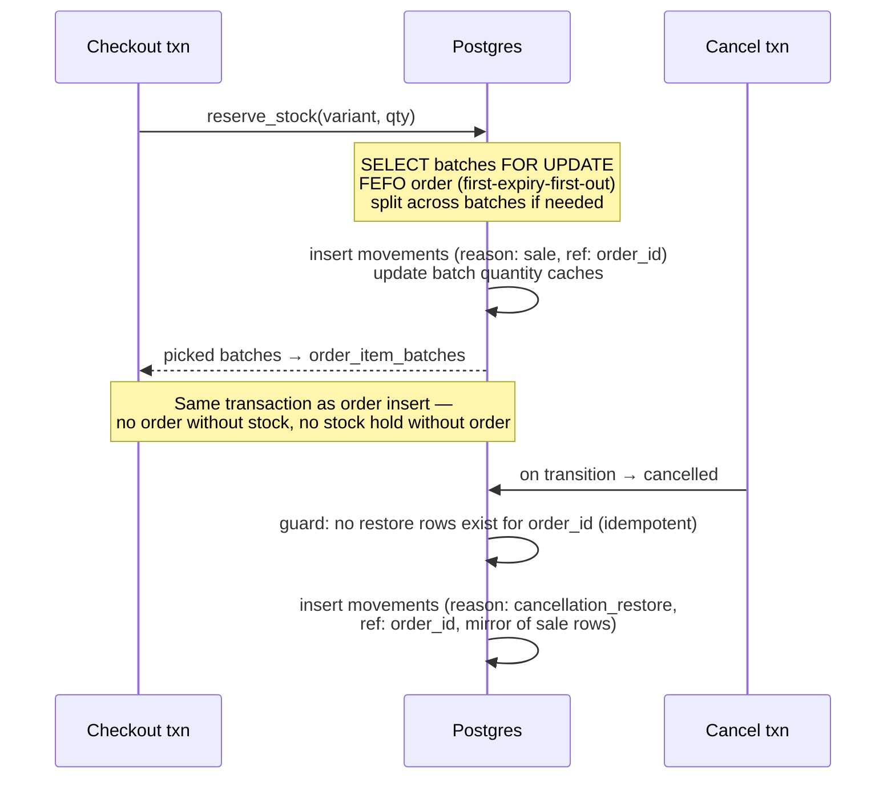

# Inventory Management Blueprint

Built on the existing schema (`0005_inventory.sql`): stock lives at **(pharmacy, variant, batch)** granularity with an append-only `stock_movements` ledger. Rule from `BLUEPRINT.md` §1.3: **ledgers over counters** — current stock is derived, movements are truth. This is what makes recalls traceable (batch → orders via `order_item_batches`) and every number auditable.

---

## 1. Core model

```
inventory_batches   id, pharmacy_id, variant_id, batch_number, expiry_date,
                    quantity (cached), cost_paisa, received_at
stock_movements     id, batch_id, delta (+/-), reason (enum), reference
                    (order_id | import_id | adjustment note), actor, created_at
stock_alerts (0019) id, variant_id, pharmacy_id, type (low|out|expiry),
                    threshold_snapshot, acknowledged_by?, created_at
```

`quantity` on a batch is a **cache** maintained in the same transaction as its movement (CHECK ≥ 0 makes overselling impossible at the DB even if app logic slips). `stock_movement_reason` enum: `purchase`, `sale`, `cancellation_restore`, `return_restore`, `adjustment`, `import`, `expiry_writeoff`, `damage`.

Variant-level *sellable stock* = Σ batch quantities where `expiry_date > today + safety window` (near-expiry stock is visible to admin but not sellable).

## 2. Feature surface

| Feature | Where | Behavior |
|---|---|---|
| Current stock | `/admin/inventory` | Per variant: sellable qty, batch breakdown, expiry flags; filter by category/brand/status |
| Low stock alert | `/admin/inventory/alerts` + notification bell + digest email | Threshold per variant (default from settings, e.g. 10); alert fires on the crossing movement — once per episode, not per view |
| Out of stock | same | Storefront shows "Out of stock" (card stays visible); alert to admin |
| Expiry warning | same | Batches expiring within N days (setting, default 90); write-off action |
| Stock history | `/admin/inventory` → variant drawer | Full movement ledger: when, delta, reason, reference (order/import/adjustment link), actor |
| Manual adjustment | `/admin/inventory/adjustments` | Requires: variant, batch (or new batch intake), delta, **reason + note mandatory**; `inventory.adjust` permission; lands in ledger + `audit_log` |
| Auto reduction on order | `place_order` transaction | See §3 |
| Auto restore on cancellation | order status machine | See §3 |

## 3. Automatic movements (correctness-critical)



- **Reduction** happens inside the order transaction with row locks (blueprint review W4) — two concurrent checkouts for the last unit: one wins, one gets a clear "only 0 left" error.
- **Restore** is a compensating ledger entry keyed to the order — re-running a cancellation cannot double-restore (idempotency by reference check). Expired-since-then batches restore as `expiry_writeoff` instead of sellable stock.
- **Gateway payments**: reservation held during `awaiting_payment`; TTL expiry (30 min) triggers the same restore path (W7).
- **Returns**: restore only on admin's explicit "restock" decision per line (damaged returns become `damage` write-offs) — never automatic on the `returned` status.

## 4. Intake

V1 intake paths: batch intake form (batch#, expiry, qty, cost — reason `purchase`) and Excel import (`IMPORT-PRODUCTS.md` §5, reason `import`, delta-to-target). Purchase orders/suppliers are future scope; the ledger's `purchase` reason and `cost_paisa` already anchor them.

## 5. Alerts pipeline

Movement commits → trigger evaluates variant sellable total against thresholds → inserts `stock_alerts` + `notifications` row (admin bell) once per episode (reset when stock rises above threshold). Daily 8am digest email groups open alerts (`EMAIL.md`), respecting per-admin notification preferences. Expiry alerts come from a daily cron scan.

## 6. Future warehouse support

Already structurally ready — this is why stock is scoped by `pharmacy_id`:

- A "warehouse" is a `pharmacies` row (rename concept to *locations* in UI later); all ledger/batch/alert logic is location-scoped today.
- Checkout currently picks from the single active location; multi-location fulfilment = a location-selection strategy (nearest-zone, most-stock) slotted into `reserve_stock()` — one function, no schema change.
- Inter-location transfers = paired movements (`transfer_out`/`transfer_in` reasons to be added to the enum) with a `transfers` table when needed.
- `/admin/warehouses` reserved in the sitemap.
