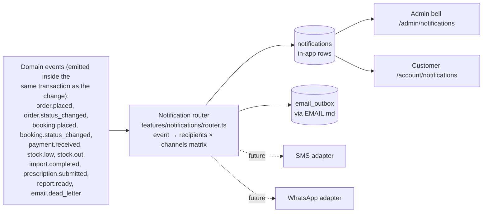

# Notification System Blueprint

One event-driven system feeding every channel: admin bell, customer in-app feed, email — with SMS/WhatsApp as future adapters. Email sending itself is delegated to the outbox (`EMAIL.md`); this module decides **who hears about what, where**.

---

## 1. Architecture: events → router → channels



The router is a **pure mapping** (event type → recipient resolution → channel list), filtered by per-user preferences, executed transactionally with the event where possible (in-app rows) and via outbox for external channels. Channels implement one interface — `deliver(recipient, notification)` — so SMS/WhatsApp are new adapters plus a preference column, zero router changes.

## 2. Data model (`0017_notifications.sql`)

```
notifications             id, recipient_user_id, type, title, body,
                          link_url, entity_ref (order/booking/etc.),
                          dedupe_key?, read_at?, created_at
notification_preferences  user_id, type_group, channel (in_app|email|sms|whatsapp),
                          enabled  — defaults per role seeded
webhook_events            (shared with payments) provider, event_id unique, payload,
                          processed_at — idempotency backbone for inbound triggers
```

## 3. Routing matrix

| Event | Admin (staff with matching permission) | Customer |
|---|---|---|
| `order.placed` | in-app + email (`admin_new_order`) | email (`order_confirmation`) |
| `order.status_changed` | in-app (assigned/watching staff) | email per status (processing/shipped/delivered/cancelled) + in-app |
| `payment.received` | in-app | email (`payment_confirmation`) |
| `booking.placed` | in-app + email (`admin_new_booking`) | email (`booking_confirmation`) |
| `booking.status_changed` | in-app | in-app; email on `report_ready` |
| `booking.reminder` (cron) | — | email (`booking_reminder`) |
| `stock.low` / `stock.out` | in-app (once per episode) + daily digest email | — |
| `prescription.submitted` | in-app → pharmacist role | in-app on approve/reject |
| `import.completed` | in-app + email → initiator | — |
| `email.dead_letter` | in-app + email → admins | — |

Admin recipient resolution is **permission-based** (e.g. `stock.low` → users holding `inventory.adjust`), never hardcoded user lists — staffing changes don't require code.

## 4. Surfaces

- **Admin bell** (header, all admin pages): unread count (polled every 60 s — no websockets in V1), dropdown of latest 10, "mark all read", link to `/admin/notifications` (full feed, filter by type, per-type preference toggles).
- **Customer feed** (`/account/notifications`): order/booking updates timeline + channel preferences. Transactional emails (order confirmation, password reset, report ready) are **not** disableable — only genuinely optional types are.
- `dedupe_key` (e.g. `stock.low:{variant}:{episode}`) prevents noise storms; notifications older than 90 days are pruned by cron.

## 5. Future SMS & WhatsApp

- Adapter interface identical to email's provider adapter; deliveries go through a channel-agnostic outbox row (the `email_outbox` generalizes to `message_outbox` — rename planned, schema shape already fits: template key, recipient, variables, retries).
- Templates: WhatsApp requires pre-approved template messages (Meta Business) — the template registry's key+variables model maps 1:1 onto that constraint by design.
- Priority order when enabled: booking reminders (highest ops value), order shipped/COD confirmation (reduces refused deliveries), then OTP login.
- Consent: `notification_preferences` rows per channel; phone-channel types default **off** until the customer opts in (regulatory posture).

## 6. Review notes

- **Nothing user-visible is fire-and-forget**: in-app rows commit with the event; external sends ride the outbox with retries (blueprint W5 applies to all channels).
- Polling beats websockets at this scale — revisit only if ops staff live in the dashboard all day (then: Supabase Realtime on `notifications`, an additive change).
- The bell must never block admin page render: unread count query is indexed (`recipient_user_id, read_at IS NULL`) and cached 60 s.
