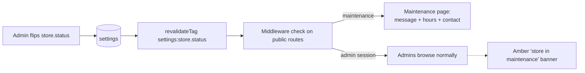

# Settings Module Blueprint

One admin surface (`/admin/settings`) where the business runs itself without code changes. Replaces the hardcoded values in `src/config/site.ts` (which becomes the **defaults/fallback layer**, not the source of truth).

---

## 1. Model: typed settings registry

```
settings          key (PK, e.g. 'business.info'), value jsonb, updated_by, updated_at
settings_history  id, key, old_value jsonb, new_value jsonb, changed_by, changed_at
```

Like CMS sections: **jsonb in the DB, Zod schema per key in code** (`features/settings/schemas/`). A registry maps key → schema → default. Reads go through one cached accessor `getSetting('business.info')` (React `cache()` + `unstable_cache` tag `settings:{key}`); writes validate against the schema, snapshot to history, write `audit_log`, and `revalidateTag` — the storefront reflects changes immediately, no deploy.

## 2. Settings groups (tabs at `/admin/settings`)

| Tab / key | Contents |
|---|---|
| `business.info` | Store name, tagline, legal name, **pharmacy license # (DRAP)** — shown in footer/trust strip |
| `business.logo` | Logo + favicon (media library refs); used by storefront header, emails, invoices |
| `business.address` | Registered address (structured); shown in footer, contact, emails |
| `business.emails` | Support email, orders email, **admin notification recipients list** |
| `business.phones` | Support phone, WhatsApp number (drives click-to-chat) |
| `business.social` | Facebook, Instagram, YouTube, TikTok, X URLs (footer icons render only non-empty) |
| `business.hours` | Per-day open/close, holiday exceptions; shown on contact + maintenance page; support-availability badge |
| `tax` | Tax mode (inclusive/exclusive), GST rate(s), tax # for invoices. V1 default: prices tax-inclusive (market norm), invoice shows breakdown |
| `currency` | Display currency (PKR), symbol position, thousands format. **Display-only** — amounts are stored as paisa; this never converts values |
| `shipping` | Default handling time, free-shipping threshold, COD limit (max order value for COD), serviceability message. Zones/rates have their own module (`/admin/shipping`) — this tab links there |
| `email` | Sender name/address, reply-to, per-email-type admin toggles, link to template editor (`EMAIL.md` §3) |
| `store.status` | `open` / `maintenance` (+ maintenance message), separate toggles: pause pharmacy orders / pause lab bookings (one vertical can close independently) |
| `inventory` | Default low-stock threshold, expiry-warning window, near-expiry sell block window (`INVENTORY.md`) |
| `checkout` | Guest checkout on/off, order-number prefix, payment TTL minutes, Rx-upload required at checkout vs after |

## 3. Store status flow



Vertical pauses are softer: browsing stays live; add-to-cart/booking CTAs disable with the configured message.

## 4. Rules

- **Permissions**: `settings.read` for viewing; `settings.write` for most tabs; `settings.critical` (admin role only) for tax, currency, store status, checkout.
- **Every change is reversible and attributable**: history table + audit log; the UI shows "last changed by X on Y" per tab and a per-key history drawer with one-click revert.
- **Fallback chain**: DB value → code default (`site.ts`). Missing/invalid DB value can never blank the storefront (same fail-safe philosophy as CMS).
- Settings consumed by emails (logo, address, socials, hours) resolve at **render time** in the outbox drain — a rebrand doesn't require touching templates.
