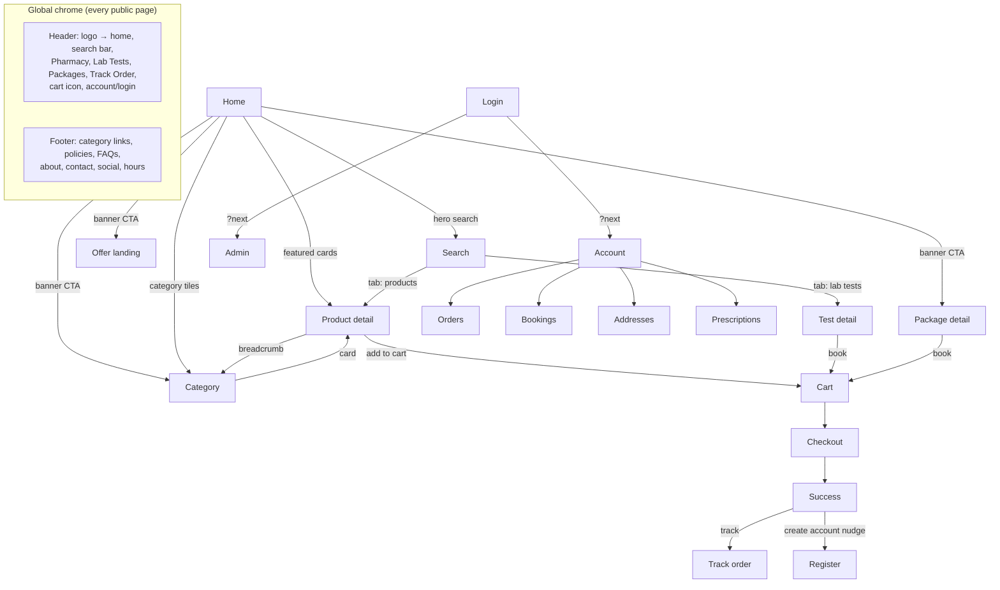

# Sehat Store — Complete Sitemap

Every page in the platform, grouped by audience, with navigation paths and UX review. Aligned with `BLUEPRINT.md` §3 and the existing `(marketing)`/`(shop)`/`admin` route groups.

---

## 1. Public Pages

| Page | Route | Purpose |
|---|---|---|
| Home | `/` | Hero, search, banners, categories, featured products, health packages, offers, trust strip |
| Pharmacy landing | `/pharmacy` | Medicine storefront: categories, brands, bestsellers |
| Product detail | `/products/[slug]` | Images, price/sale price, Rx badge, stock state, add-to-cart, related |
| Category listing | `/categories/[slug]` | Filter (brand, price, availability), sort, pagination |
| Search results | `/search?q=` | Unified: products + lab tests + packages, tabbed |
| Lab tests landing | `/lab-tests` | Test catalog, category filter, home-collection badge |
| Lab test detail | `/lab-tests/[slug]` | Price, preparation, report time, book CTA |
| Health packages | `/health-packages` | Package cards with included-test counts |
| Package detail | `/health-packages/[slug]` | Included tests, combined price vs individual |
| About | `/about` | CMS-driven |
| Contact | `/contact` | CMS-driven details + message form |
| FAQs | `/faqs` | CMS-driven, grouped, searchable |
| Privacy Policy | `/policies/privacy` | CMS singleton |
| Terms | `/policies/terms` | CMS singleton |
| Shipping Policy | `/policies/shipping` | CMS singleton |
| Return Policy | `/policies/returns` | CMS singleton |
| Track order (guest) | `/track-order` | Order# + phone verification → status timeline |

## 2. Authentication Pages

| Page | Route | Notes |
|---|---|---|
| Login | `/login` | Shared customer/staff; `?next=` return path |
| Register | `/register` | Email + password; triggers welcome + verify emails |
| Forgot password | `/forgot-password` | Always shows "if the account exists…" (no enumeration) |
| Reset password | `/reset-password?token=` | Single-use, 30-min TTL; invalidates all sessions |
| Verify email | `/verify-email?token=` | Confirmation state page |

## 3. Customer Pages (`/account/*`, session required)

| Page | Route |
|---|---|
| Account overview | `/account` — recent orders, upcoming bookings, quick links |
| Order history | `/account/orders` |
| Order detail | `/account/orders/[orderNumber]` — timeline, items, invoice, reorder, cancel (while allowed) |
| Lab bookings | `/account/bookings` |
| Booking detail | `/account/bookings/[id]` — slot, patients, reschedule/cancel, report download |
| Addresses | `/account/addresses` — CRUD, default per type |
| Prescriptions | `/account/prescriptions` — upload wallet, review status |
| Notifications | `/account/notifications` — in-app feed + channel preferences |
| Profile settings | `/account/settings` — name, phone, password change |

## 4. Checkout Pages

| Page | Route | Notes |
|---|---|---|
| Cart | `/cart` | Line edit, coupon, stock warnings, Rx notice |
| Checkout | `/checkout` | Single page, 3 sections: contact/address → shipping method → payment; guest or logged-in |
| Payment redirect | `/checkout/pay/[orderNumber]` | Gateway flow only (future card payments) |
| Success | `/checkout/success/[orderNumber]` | Summary, tracking link, account-creation nudge for guests |

## 5. Admin Pages (`/admin/*`, permission-gated)

| Module | Routes |
|---|---|
| Dashboard | `/admin` |
| Products | `/admin/products`, `/admin/products/new`, `/admin/products/[id]/edit` |
| Categories / Brands | `/admin/categories`, `/admin/brands` |
| Inventory | `/admin/inventory`, `/admin/inventory/adjustments`, `/admin/inventory/alerts` |
| Orders | `/admin/orders`, `/admin/orders/[orderNumber]` |
| Customers | `/admin/customers`, `/admin/customers/[id]` |
| Lab tests | `/admin/lab-tests`, `/admin/lab-tests/new`, `/admin/lab-tests/[id]/edit` |
| Health packages | `/admin/health-packages` (+ new/edit) |
| Lab bookings | `/admin/lab-bookings`, `/admin/lab-bookings/[id]` (status, report upload) |
| Collection slots | `/admin/lab-slots` |
| Prescriptions | `/admin/prescriptions` (review queue), `/admin/prescriptions/[id]` |
| Coupons | `/admin/coupons` (+ new/edit) |
| Shipping | `/admin/shipping` (zones, methods, rates) |
| CMS | `/admin/cms` hub → `/admin/cms/{banners,sections,offers,pages,faqs,media}` |
| Imports | `/admin/imports`, `/admin/imports/new`, `/admin/imports/[id]` (report) |
| Reports | `/admin/reports` (+ `/sales`, `/products`, `/customers`) |
| Notifications | `/admin/notifications` (feed + rules) |
| Settings | `/admin/settings` → tabs: business, tax, currency, shipping, email, store-status, hours |
| Forbidden | `/admin/forbidden` |

## 6. Error & System Pages

| Page | Trigger |
|---|---|
| 404 `not-found.tsx` | Unknown route/slug — search box + popular categories, not a dead end |
| 500 `error.tsx` | Runtime error — retry button, support contact |
| `/admin/forbidden` | Authenticated but lacking permission |
| Maintenance interstitial | `settings.store_status = maintenance` (middleware; admin exempt) |
| Offline/empty states | Component-level: empty cart, no results, no orders |

## 7. Future Pages (reserved, not built in V1)

- `/blog`, `/blog/[slug]` — health content SEO
- `/doctors`, `/consultations` — teleconsultation vertical
- `/account/wallet` — store credit / refund wallet
- `/account/subscriptions` — recurring medicine refills
- `/(ur)/*` — Urdu locale tree
- `/app` — native-app landing page
- `/admin/warehouses` — multi-location inventory UI (schema already supports)

---

## 8. Navigation Map

**Navigation rules (explicit):**

- **Header** is persistent on all public/customer pages: primary nav (Pharmacy, Lab Tests, Health Packages), search, cart badge (live count), account menu (login → Account/Orders/Logout when authed). Sticky on scroll, collapses to bottom-sheet menu on mobile.
- **Breadcrumbs** on every catalog page: Home › Category › Product; Home › Lab Tests › Test. Detail pages link back to their listing with filters preserved (URL-encoded filter state).
- **Cart → Checkout** is linear and interruption-free: header shrinks to logo + secure badge during checkout (no nav exits mid-funnel); logo confirms before abandoning.
- **Success page** branches: guests → track-order + account nudge; users → order detail.
- **Account** uses a left rail (desktop) / tab bar (mobile) across its 8 subpages; every order/booking row → its detail.
- **Admin** uses the existing sidebar (`config/admin-nav.ts`), grouped: Commerce (orders, customers), Catalog (products, categories, brands, inventory, imports), Lab (tests, packages, bookings, slots), Content (CMS), Insights (reports), System (notifications, settings). Breadcrumb + global search (order#, SKU, customer phone) in the admin header. Notification bell → `/admin/notifications`.
- **Errors**: 404 offers search + category links; forbidden links back to dashboard; maintenance page shows business hours + contact from settings.

## 9. UX Improvements (adopted)

1. **Unified search with tabs** (products | lab tests | packages) instead of separate searches — users don't know your information architecture.
2. **Guest checkout is default**; account creation is a *post-purchase* one-click nudge (password only — email/phone already captured). Highest-converting pattern for COD markets.
3. **Sticky mobile add-to-cart bar** on PDP; sticky "Book now" with price on test/package detail.
4. **Stock and Rx states surfaced early**: "Rx required" badge on cards, not just detail; out-of-stock cards stay visible with "notify me" (future) rather than disappearing.
5. **Cart resilience**: price/stock changes since add are shown as inline diffs ("price dropped ₨50", "only 2 left") — never silent mutation.
6. **Track-order in the header**, not buried in footer — COD customers track obsessively; this deflects support calls.
7. **Preparation instructions surfaced at booking time** (fasting etc.) and repeated in confirmation + reminder emails — the top lab-ops failure mode.
8. **Trust strip** on home + checkout: licensed-pharmacy number, genuine-medicine badge, secure-payment icons, support phone — healthcare demands more trust signaling than general retail.
9. **Skeleton loaders + optimistic cart updates** to mask RSC round-trips.
10. **Admin global search** (order#, SKU, phone) — staff workflows are lookup-driven, not menu-driven.
11. **Empty states teach**: empty cart shows featured products; no-orders shows category links; admin empty imports page links to the Excel template.
12. **WhatsApp click-to-chat button** (from settings) on contact + order pages — dominant support channel in the market.
